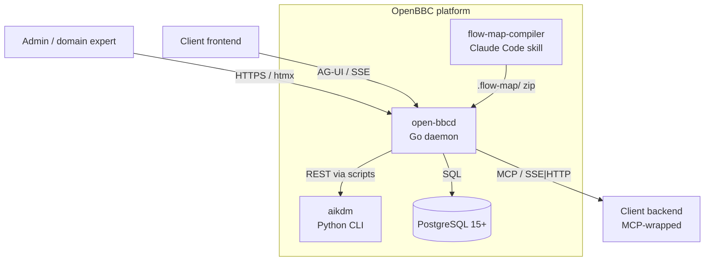

# OpenBBC — Architecture home

## System at a glance

<!-- migrated from _migration-quarantine/ARCHITECTURE.md § System Overview, DESIGN.md § Architecture Overview on 2026-09-28 -->

## Map of content

Top-level cross-cutting:
- [`nfrs.md`](nfrs.md) — availability / performance / security / compliance / observability targets
- [`assumptions.md`](assumptions.md) — scope assumptions, locked decisions, open questions
- [`constraints.md`](constraints.md) — regulatory regimes, compliance obligations, hard technical limits
- [`glossary.md`](glossary.md) — terminology

BIZBOK lens (business layer):
- [`bizbok/README.md`](bizbok/README.md)
- [`bizbok/capabilities.md`](bizbok/capabilities.md)
- [`bizbok/stakeholders.md`](bizbok/stakeholders.md)
- [`bizbok/value-streams.md`](bizbok/value-streams.md)
- [`bizbok/information-map.md`](bizbok/information-map.md)

DDD lens (domain layer):
- [`ddd/README.md`](ddd/README.md)
- [`ddd/context-map.md`](ddd/context-map.md)
- [`ddd/contexts/agent-lifecycle.md`](ddd/contexts/agent-lifecycle.md)
- [`ddd/contexts/feedback-datasets.md`](ddd/contexts/feedback-datasets.md)
- [`ddd/contexts/evaluation.md`](ddd/contexts/evaluation.md)
- [`ddd/contexts/training.md`](ddd/contexts/training.md)
- [`ddd/contexts/deployed-runtime.md`](ddd/contexts/deployed-runtime.md)
- [`ddd/contexts/discovery.md`](ddd/contexts/discovery.md)
- [`ddd/access-model.md`](ddd/access-model.md)

C4 lens (system/infra layer):
- [`c4/README.md`](c4/README.md)
- [`c4/context.md`](c4/context.md)
- [`c4/containers.md`](c4/containers.md)
- [`c4/data-flows.md`](c4/data-flows.md)
- [`c4/deployment.md`](c4/deployment.md)
- [`c4/integrations.md`](c4/integrations.md)

## Reading order

1. `README.md` (this file) — orientation + diagram
2. `bizbok/capabilities.md` and `bizbok/value-streams.md` — what the system does, for whom
3. `ddd/context-map.md` — how the domain is carved into bounded contexts
4. `c4/context.md` → `c4/containers.md` → `c4/data-flows.md` → `c4/deployment.md` — how it runs
5. `nfrs.md`, `constraints.md`, `assumptions.md` — the operating envelope
6. `ddd/access-model.md`, `c4/integrations.md` — trust boundaries and external contracts
