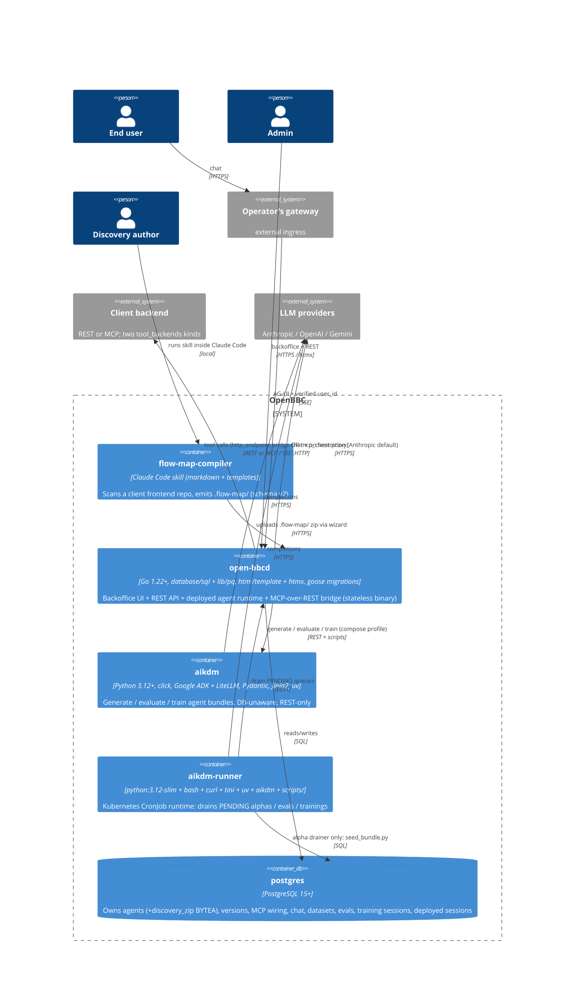

# Containers

## Diagram

<!-- migrated from _migration-quarantine/ARCHITECTURE.md § System Overview, § Components, § Docker deployment, DESIGN.md § Tech Stack on 2026-09-28. Updated 2026-09-28 for OpenBBC PR #50 — added aikdm-runner container, clarified client-backend integration as REST-bridge OR MCP-proxy, added agents.discovery_zip data ownership. -->

### flow-map-compiler {#flow-map-compiler}

**Purpose.** Claude Code plugin skill that scans a client frontend repo and emits a
structured wiki proposing an MCP tool surface for the backend the frontend talks to. Fully
agent-driven — no scripted pipeline. Anti-goals (LOCKED): never generate MCP server code,
runtime agent prompts, or call any registry API; never assume an MCP server exists; never
run target-repo code.

**Tech stack.** Markdown-based skill (no build step). Shipped from
`bbc-discovery/flow-map-compiler/` inside the DACdigital/OpenBBC repo. Schema version `2`:
outputs `AGENTS.md`, `APP.md`, `glossary.md`, `skills/<id>.md`, `flows/<id>.md`,
`endpoints/<id>.md` (all frontmatter carries `schema_version: 2`; endpoints carry
`proposed: true`). Contract triple:
`references/output-schemas.md` ↔ `references/lint-contract.md` ↔ `assets/templates/*.tmpl`.

**Data ownership.** None inside OpenBBC. The skill runs on the discovery author's machine
against a target frontend repo. The `.flow-map/` tree lives inside the target repo and its
zip lives ephemerally on the author's machine until uploaded via the wizard; at that point
`open-bbcd` stores the zip inline on `agents.discovery_zip BYTEA` (migration 026).

**Published API / events.** Emits a `.flow-map/` zip via the wizard upload. No REST /
runtime surface.

**DDD context.** [`ddd/contexts/discovery.md`](../ddd/contexts/discovery.md).

**Modularity node.** ARCH_GAP (populated later by `/modularize`).

<!-- migrated from _migration-quarantine/ARCHITECTURE.md § flow-map-compiler, DESIGN.md § Components on 2026-09-28. Updated 2026-09-28 with the flow-map-compiler skill's current schema v2 layout + LOCKED anti-goals. -->

### open-bbcd {#open-bbcd}

**Purpose.** Backoffice UI + REST API + deployed agent runtime, all in one Go binary. Two
orchestrator instances (BO chat + Deployed) share a stateless `tools.Builder`
(`internal/handler/api.go:123`).

**Tech stack.** Go 1.22+, `database/sql` + `lib/pq`, `html/template` + htmx (server-rendered,
no SPA; entrypoint `internal/handler/api.go:194`), `goose` migrations embedded via
`//go:embed`. Multi-stage, multi-arch Docker image (`golang:1.26` builder,
`gcr.io/distroless/static-debian12:nonroot` runtime, CGO off). Binary subcommands: `serve`
(default), `migrate`, `healthcheck`.

**Data ownership.** Owns everything in `postgres` transactionally on behalf of the DDD
contexts: `agents` (+ `discovery_zip BYTEA` migration 026), `agent_versions` (`status ∈
{INITIALIZING, PENDING, DRAFT, TRAINING, READY, DEPLOYED}` per migration 025),
`capabilities[]`, `tool_backends`, `agent_endpoint_backend`, `agent_version_mcp_backend`,
`chat_sessions` + `chat_messages` + `chat_message_feedback`, `datasets` + `dataset_versions`
+ `dataset_version_sessions`, `evals` + `eval_sessions`, `training_sessions`,
`deployed_sessions` + `deployed_messages`. **Stateless at the process level** — no local
disk required after migration 026 removed the discovery-storage directory
(`DISCOVERY_STORAGE_DIR` env var no longer read; `internal/storage/storage.go` removed).

**Published API / events.**
- REST (JSON): `/evals/*`, `/training-sessions/*`, `/datasets/*`, `/agents/*/deploy`,
  `/agents/*/undeploy`, `/mcp*`, `/deployed/{agent_id}/sessions[/*]`, `/health`.
- Backoffice UI: `/`, `/agents/ui`, `/agents/new`, `/agents/{id}/configure/*`,
  `/agent_versions/{id}/configure/*`, `/mcp`, `/datasets*`, `/evals`,
  `/training-sessions`, `/agent_versions/{v}/chat[/{s}/*]`.
- AG-UI SSE stream on `/deployed/{agent_id}/sessions/{session_id}/turn`.
- MCP outbound to registered `tool_backends` (SSE / Streamable HTTP).

**DDD contexts.** [`agent-lifecycle`](../ddd/contexts/agent-lifecycle.md),
[`feedback-datasets`](../ddd/contexts/feedback-datasets.md),
[`evaluation`](../ddd/contexts/evaluation.md) (state + UI),
[`training`](../ddd/contexts/training.md) (state + UI),
[`deployed-runtime`](../ddd/contexts/deployed-runtime.md).

**Modularity node.** ARCH_GAP (populated later by `/modularize`).

<!-- migrated from _migration-quarantine/ARCHITECTURE.md § open-bbcd, § MCP wiring, § Feedback + datasets, § Evals, § Training sessions, § Docker deployment, DESIGN.md § Tech Stack, PRODUCTION.md § 1 Deploying on 2026-09-28 -->

### aikdm {#aikdm}

**Purpose.** LLM-heavy work — generation, evaluation, training. Out-of-process and
DB-unaware; only talks REST to `open-bbcd` through `scripts/run_eval.sh` and
`scripts/train_from_session.sh` (and, for the new alpha drainer, wraps `generate_alpha.sh`
whose `seed_bundle.py` sidecar writes bundles directly to Postgres — but that DB write is
in the sidecar, not in `aikdm` itself).

**Tech stack.** Python 3.12+, click (CLI), Pydantic (schemas), Jinja2 (templates), PyYAML,
Google ADK with LiteLLM (multi-provider: Anthropic, OpenAI, Gemini). Deps managed with `uv`.
Multi-stage Docker image: `python:3.12-slim` builder + `uv sync --frozen`, runtime as user
`aikdm` (uid 65532). Published to `ghcr.io/dacdigital/openbbc/aikdm` on every PR / merge /
tag; today the Helm chart does not use this image (it uses `aikdm-runner` for k8s drains)
but the CI still publishes it for consistency.

**Data ownership.** None persistent. Reads `flow-map-config.yaml` / `eval-input.yaml` +
writes `bundle.yaml` / `eval-result.json` / `training-report.json` to `--out` dirs (typically
mounted at `/work`). Non-zero exit produces structured JSON on stderr
(`{"error":"<kind>","details":"<msg>"}`; codes `1` unexpected · `2` input/config · `3` LLM).

**Published API / events.** CLI subcommands `generate-agent`, `evaluate`, `train-agent`
(`aikdm/aikdm/cli.py`); consumed via `scripts/*.sh` wrappers from `open-bbcd` and by
operators directly. Bundle format declared in `aikdm/schemas/prompt-v1.yaml` (versioned).

**DDD contexts.** [`agent-lifecycle`](../ddd/contexts/agent-lifecycle.md) (generation),
[`evaluation`](../ddd/contexts/evaluation.md) (scoring pipeline),
[`training`](../ddd/contexts/training.md) (hill-climb loop).

**Modularity node.** ARCH_GAP (populated later by `/modularize`).

<!-- migrated from _migration-quarantine/ARCHITECTURE.md § aikdm, § Docker deployment, DESIGN.md § Tech Stack, § Phase III on 2026-09-28. Updated 2026-09-28 for OpenBBC PR #50 (GHCR publish, aikdm-runner separation, alpha drainer scripted composition). -->

### aikdm-runner {#aikdm-runner}

**Purpose.** Kubernetes CronJob runtime that drains `PENDING` alpha generations,
`PENDING` evals, and `PENDING` training sessions from an `open-bbcd` instance. Introduced
in OpenBBC PR #50 alongside the Helm chart. Runs one of three scripts per
CronJob: `scripts/process_pending_alphas.sh`, `scripts/process_pending_evals.sh`, or
`scripts/process_pending_trainings.sh` — each flock-protected, serial, continue-on-error.

**Tech stack.** Multi-stage image from `Dockerfile.aikdm-runner`: `python:3.12-slim` builder
runs `uv sync --frozen --no-dev`; runtime layer adds `bash`, `curl`, `ca-certificates`,
`tini`, `uv`, the built `aikdm/` virtualenv, and the top-level `scripts/` directory.
Runs as user `runner` (uid 65532). ENTRYPOINT `/usr/bin/tini --`; CronJobs set the actual
command per drainer script. Published to `ghcr.io/dacdigital/openbbc/aikdm-runner` on every
PR / merge / tag.

**Data ownership.** None persistent inside the container. The alpha drainer path
(`generate_alpha.sh` → `aikdm generate-agent` + `seed_bundle.py`) writes the resulting
bundle directly to Postgres — so the alpha CronJob mounts `DATABASE_URL` as a Secret,
crossing the trust boundary into the Data zone. The eval and training drainers only speak
REST to `open-bbcd`.

**Published API / events.** No inbound surface. Outbound: REST to `open-bbcd`
(`/agent_versions.json?status=PENDING`, `/evals.json?status=PENDING`,
`/training-sessions.json?status=PENDING`, plus the per-item start / result / complete / fail
endpoints); LLM provider APIs; SQL to Postgres for the alpha path only.

**DDD contexts.** Operator side of [`agent-lifecycle`](../ddd/contexts/agent-lifecycle.md)
(alpha drainer state transitions), [`evaluation`](../ddd/contexts/evaluation.md), and
[`training`](../ddd/contexts/training.md). Not an owner of any aggregate — it's a scripted
driver against `open-bbcd`'s REST surface.

**Modularity node.** ARCH_GAP (populated later by `/modularize`).

<!-- new container introduced in OpenBBC PR #50 (Dockerfile.aikdm-runner + deploy/helm/openbbc/templates/cronjob-{alphas,evals,trainings}.yaml + scripts/process_pending_alphas.sh + .github/workflows/publish-images.yml); migrated from those sources on 2026-09-28 -->

### postgres {#postgres}

**Purpose.** Relational store for every stateful thing in OpenBBC.

**Tech stack.** PostgreSQL 15+; `goose` migrations run by `open-bbcd` on boot (embedded via
`//go:embed`, currently at `026_agent_discovery_zip`). Compose brings up `postgres` service
healthchecked with `pg_isready`; named volume `postgres-data` persists across
`docker compose down`. In k8s the Helm chart ships an optional in-cluster `StatefulSet`;
production deployments typically point `externalDatabase.url` at a managed DB and disable
the in-cluster one.

**Data ownership.** All persisted domain state (see `open-bbcd` for the table list) plus
inline `agents.discovery_zip` binary blobs (migration 026). The legacy `resources` table
(migration 002) and `/resources` CRUD surface remain but are not on the shipped MCP path —
real MCP wiring lives on `tool_backends` + `agent_endpoint_backend` +
`agent_version_mcp_backend`.

**Published API / events.** SQL to `open-bbcd` (all paths). Also SQL to `aikdm-runner` on
the alpha-drainer path only (`seed_bundle.py` writes the generated bundle + `READY` status
directly). `aikdm` itself never opens a DB connection.

**DDD contexts.** Materialises state for all DDD contexts. Not a bounded context of its own.

**Modularity node.** ARCH_GAP (populated later by `/modularize`).

<!-- migrated from _migration-quarantine/ARCHITECTURE.md § PostgreSQL, § Docker deployment on 2026-09-28 -->
