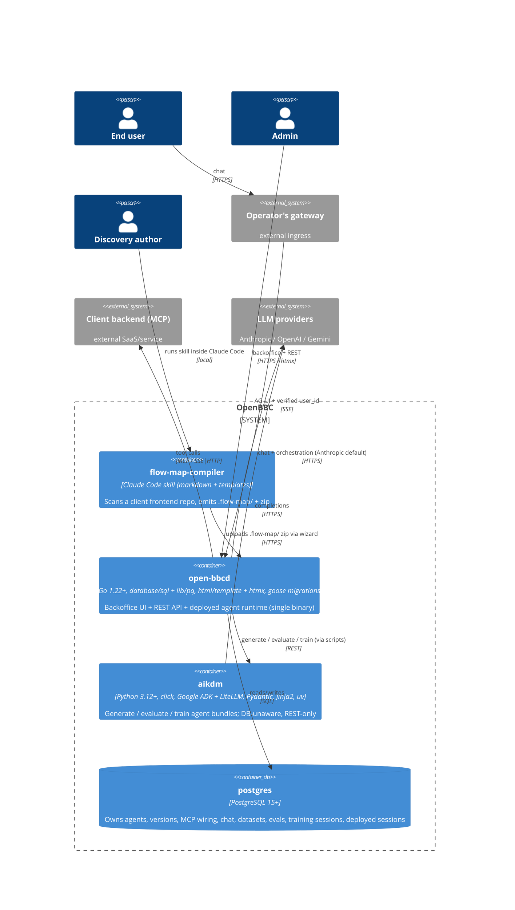

# Containers

## Diagram

<!-- migrated from _migration-quarantine/ARCHITECTURE.md § System Overview, § Components, § Docker deployment, DESIGN.md § Tech Stack on 2026-09-28 -->

### flow-map-compiler {#flow-map-compiler}

**Purpose.** Claude Code plugin skill that extracts business flows + backend capabilities
from a client frontend repo. Fully agent-driven — no scripted pipeline. Output is a
`.flow-map/` directory (`flows/`, `capabilities/`, `agents/`) plus a zip uploaded via the
`/agents/new` wizard.

**Tech stack.** Markdown-based skill (no build step). Shipped from
`bbc-discovery/flow-map-compiler/` inside the DACdigital/OpenBBC repo. Contract triple:
`references/output-schemas.md` ↔ `references/lint-contract.md` ↔ `assets/templates/*.tmpl`.

**Data ownership.** None inside OpenBBC — the skill runs on the discovery author's machine
against a target frontend repo. The `.flow-map/` tree lives inside the target repo (and its
zip lives ephemerally on the author's machine until uploaded).

**Published API / events.** Emits a `.flow-map/` zip via the wizard upload. No REST /
runtime surface.

**DDD context.** [`ddd/contexts/discovery.md`](../ddd/contexts/discovery.md).

**Modularity node.** ARCH_GAP (populated later by `/modularize`).

<!-- migrated from _migration-quarantine/ARCHITECTURE.md § flow-map-compiler, DESIGN.md § Components on 2026-09-28 -->

### open-bbcd {#open-bbcd}

**Purpose.** Backoffice UI + REST API + deployed agent runtime, all in one Go binary. Two
orchestrator instances (BO chat + Deployed) share a stateless `tools.Builder`
(`internal/handler/api.go:123`).

**Tech stack.** Go 1.22+, `database/sql` + `lib/pq`, `html/template` + htmx (server-rendered,
no SPA; entrypoint `internal/handler/api.go:194`), `goose` migrations embedded via
`//go:embed`. Multi-stage, multi-arch Docker image (`golang:1.26` builder,
`gcr.io/distroless/static-debian12:nonroot` runtime, CGO off). Binary subcommands: `serve`
(default), `migrate`, `healthcheck`.

**Data ownership.** Owns everything in `postgres` transactionally on behalf of the DDD
contexts: `agents`, `agent_versions`, `capabilities[]`, `tool_backends`,
`agent_endpoint_backend`, `agent_version_mcp_backend`, `chat_sessions` + `chat_messages` +
`chat_message_feedback`, `datasets` + `dataset_versions` + `dataset_version_sessions`, `evals`
+ `eval_sessions`, `training_sessions`, `deployed_sessions` + `deployed_messages`. Also owns
the discovery-storage directory (`DISCOVERY_STORAGE_DIR`, default `/data/discovery`) for
uploaded `.flow-map/` zips.

**Published API / events.**
- REST (JSON): `/evals/*`, `/training-sessions/*`, `/datasets/*`, `/agents/*/deploy`,
  `/agents/*/undeploy`, `/mcp*`, `/deployed/{agent_id}/sessions[/*]`, `/health`.
- Backoffice UI: `/`, `/agents/ui`, `/agents/new`, `/agents/{id}/configure/*`,
  `/agent_versions/{id}/configure/*`, `/mcp`, `/datasets*`, `/evals`,
  `/training-sessions`, `/agent_versions/{v}/chat[/{s}/*]`.
- AG-UI SSE stream on `/deployed/{agent_id}/sessions/{session_id}/turn`.
- MCP outbound to registered `tool_backends` (SSE / Streamable HTTP).

**DDD contexts.** [`agent-lifecycle`](../ddd/contexts/agent-lifecycle.md),
[`feedback-datasets`](../ddd/contexts/feedback-datasets.md),
[`evaluation`](../ddd/contexts/evaluation.md) (state + UI),
[`training`](../ddd/contexts/training.md) (state + UI),
[`deployed-runtime`](../ddd/contexts/deployed-runtime.md).

**Modularity node.** ARCH_GAP (populated later by `/modularize`).

<!-- migrated from _migration-quarantine/ARCHITECTURE.md § open-bbcd, § MCP wiring, § Feedback + datasets, § Evals, § Training sessions, § Docker deployment, DESIGN.md § Tech Stack, PRODUCTION.md § 1 Deploying on 2026-09-28 -->

### aikdm {#aikdm}

**Purpose.** LLM-heavy work — generation, evaluation, training. Out-of-process and
DB-unaware; only talks REST to `open-bbcd` through `scripts/run_eval.sh` and
`scripts/train_from_session.sh`.

**Tech stack.** Python 3.12+, click (CLI), Pydantic (schemas), Jinja2 (templates), PyYAML,
Google ADK with LiteLLM (multi-provider: Anthropic, OpenAI, Gemini). Deps managed with `uv`.
Multi-stage Docker image: `python:3.12-slim` builder + `uv sync --frozen`, runtime as user
`aikdm` (uid 65532).

**Data ownership.** None persistent. Reads `flow-map-config.yaml` / `eval-input.yaml` +
writes `bundle.yaml` / `eval-result.json` / `training-report.json` to `--out` dirs (typically
mounted at `/work`). Non-zero exit produces structured JSON on stderr
(`{"error":"<kind>","details":"<msg>"}`; codes `1` unexpected · `2` input/config · `3` LLM).

**Published API / events.** CLI subcommands `generate-agent`, `evaluate`, `train-agent`
(`aikdm/aikdm/cli.py`); consumed via `scripts/*.sh` wrappers from `open-bbcd` and by
operators directly. Bundle format declared in `aikdm/schemas/prompt-v1.yaml` (versioned).

**DDD contexts.** [`agent-lifecycle`](../ddd/contexts/agent-lifecycle.md) (generation),
[`evaluation`](../ddd/contexts/evaluation.md) (scoring pipeline),
[`training`](../ddd/contexts/training.md) (hill-climb loop).

**Modularity node.** ARCH_GAP (populated later by `/modularize`).

<!-- migrated from _migration-quarantine/ARCHITECTURE.md § aikdm, § Docker deployment, DESIGN.md § Tech Stack, § Phase III on 2026-09-28 -->

### postgres {#postgres}

**Purpose.** Relational store for every stateful thing in OpenBBC.

**Tech stack.** PostgreSQL 15+; `goose` migrations run by `open-bbcd` on boot (embedded via
`//go:embed`, currently at `024_training_sessions`). Compose brings up `postgres` service
healthchecked with `pg_isready`; named volume `postgres-data` persists across
`docker compose down`.

**Data ownership.** All persisted domain state (see `open-bbcd` for the table list). The
legacy `resources` table (migration 002) and `/resources` CRUD surface remain but are not on
the shipped MCP path — real MCP wiring lives on `tool_backends` + `agent_endpoint_backend` +
`agent_version_mcp_backend`.

**Published API / events.** SQL to `open-bbcd` only. `aikdm` never opens a DB connection.

**DDD contexts.** Materialises state for all DDD contexts. Not a bounded context of its own.

**Modularity node.** ARCH_GAP (populated later by `/modularize`).

<!-- migrated from _migration-quarantine/ARCHITECTURE.md § PostgreSQL, § Docker deployment on 2026-09-28 -->
