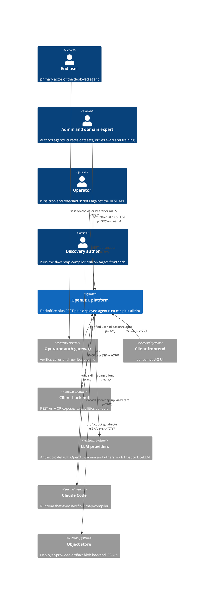

# System context

## Diagram

<!-- migrated from _migration-quarantine/ARCHITECTURE.md § System Overview, § Protocols, DESIGN.md § Architecture Overview, PRODUCTION.md § 2 Integrating your frontend, § 5 Auth model on 2026-09-28. Updated 2026-10-07 for bifrost — LLM providers reachable from open-bbcd via the embedded Bifrost Go SDK. Updated 2026-10-07 for sync-bifrost — v1 provider allow-list. -->

## External actors

Linked to [`../bizbok/stakeholders.md`](../bizbok/stakeholders.md):

- **End user** — consumes the deployed runtime via AG-UI (through the operator's gateway).
- **Admin / domain expert** — privileged BO surface user.
- **Operator** — REST automation caller (cron + one-shot scripts).
- **Discovery author** — runs the `flow-map-compiler` Claude Code skill against a target
  frontend repo.

## External systems

Linked to [`integrations.md`](integrations.md):

- **Client frontend** — the customer's UI, speaks AG-UI to `open-bbcd`.
- **Client backend (MCP-wrapped)** — the customer's business backend, exposes capabilities
  over MCP (SSE / Streamable HTTP).
- **LLM providers** — Anthropic (default for `open-bbcd`), OpenAI, Gemini (aikdm via
  LiteLLM). `open-bbcd` can alternatively reach the v1 key-only provider allow-list
  (anthropic, openai, gemini, mistral, groq, cohere, openrouter, deepseek, xai, cerebras) through the embedded Bifrost Go SDK (`OPENBBC_LLM_ADAPTER=bifrost`); Bifrost is a library inside `open-bbcd`, not
  an external system.
- **Operator's auth gateway** — external ingress that verifies callers and injects a
  verified `user_id` before forwarding to the deployed runtime.
- **Claude Code** — host for the `flow-map-compiler` skill; runs on the discovery author's
  machine.
- **Object store** — deployer-provided artifact blob backend (AWS S3, MinIO, GCS with HMAC,
  R2, B2, any S3-API endpoint). Reached from `open-bbcd` via the `artifact-store-adapter`
  (`s3_compatible` first kind) using deployer-configured credentials from
  `ARTIFACT_STORE_<ID>_*` env vars (there is no `artifact_stores` table).

<!-- migrated from _migration-quarantine/PRODUCTION.md § 2, § 5, § 7, ARCHITECTURE.md § Protocols on 2026-09-28. Updated 2026-09-28 for artifact-support — added Object store external system. Updated 2026-10-01 for sync-deployed-runtime-artifacts — Object store credentials come from env vars. -->

## System boundary

**Inside OpenBBC:** the `flow-map-compiler` skill (packaged as a Claude Code plugin from
`bbc-discovery/flow-map-compiler/`), `open-bbcd` (Go daemon: backoffice UI + REST API +
deployed runtime), `aikdm` (Python CLI, out-of-process), and the PostgreSQL 15+ store. All
are built and released together in the DACdigital/OpenBBC monorepo.

**Outside OpenBBC:** the customer's frontend + backend, the operator's auth gateway, the LLM
providers, the Claude Code runtime, and the deployer-provided artifact object store.

**Key gateway property:** the boundary between end user and `open-bbcd` is not defended by
`open-bbcd` itself — every non-trusted-network deployment relies on the operator's gateway
to verify identity and inject `user_id`.

<!-- migrated from _migration-quarantine/PRODUCTION.md § 5 Auth model, ARCHITECTURE.md § Components on 2026-09-28 -->
