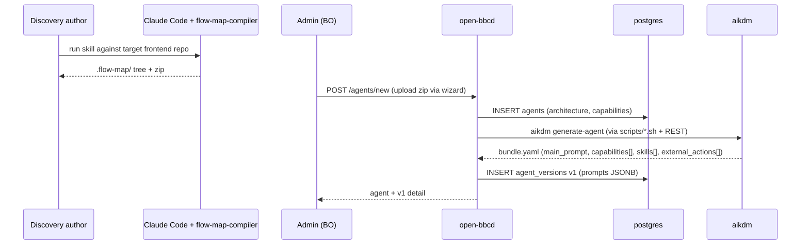

# Data flows

## Discovery → alpha agent



<!-- migrated from _migration-quarantine/DESIGN.md § Phase 0, § Phase I, ARCHITECTURE.md § Data Flow / Flow 1 on 2026-09-28 -->

## Feedback → dataset

```mermaid
sequenceDiagram
    participant Admin as Admin (BO)
    participant OBBCD as open-bbcd
    participant DB as postgres
    participant MCP as Client backend (MCP)

    Admin->>OBBCD: GET /agent_versions/{v}/chat
    OBBCD->>DB: INSERT chat_sessions
    Admin->>OBBCD: POST turn (user message)
    OBBCD->>MCP: tool call (with backend_header_overrides if set)
    MCP-->>OBBCD: tool result
    OBBCD-->>Admin: assistant reply
    Admin->>OBBCD: POST feedback (rating, comment, expected_output, judge_criteria)
    OBBCD->>DB: INSERT chat_message_feedback
    Admin->>OBBCD: POST /chat/{s}/assign-dataset
    OBBCD->>DB: INSERT dataset_version_sessions (DRAFT)
    Admin->>OBBCD: POST /datasets/{id}/close-draft/confirm
    OBBCD->>DB: UPDATE dataset_versions SET status=CLOSED; UPDATE chat_sessions SET locked_at=now(); INSERT next DRAFT seeded from CLOSED
    OBBCD-->>Admin: dataset detail (CLOSED v_n, DRAFT v_{n+1})
```

<!-- migrated from _migration-quarantine/DESIGN.md § Phase II, ARCHITECTURE.md § Feedback + datasets, § Data Flow / Flow 2, § Chat header overrides on 2026-09-28 -->

## Evaluation

```mermaid
sequenceDiagram
    participant Admin as Admin (BO)
    participant OBBCD as open-bbcd
    participant DB as postgres
    participant Op as Operator (script or cron)
    participant AIK as aikdm
    participant MCP as Client backend (MCP)

    Admin->>OBBCD: POST /evals (agent_version_id, dataset_version_id, mock_mcp_tools, header_overrides)
    OBBCD->>DB: INSERT evals (status=PENDING)
    Op->>OBBCD: GET /evals/{id}/export.yaml
    Op->>OBBCD: POST /evals/{id}/start
    OBBCD->>DB: UPDATE evals SET status=IN_PROGRESS
    Op->>AIK: uv run aikdm evaluate --input ... --output ...
    loop per session
        AIK->>AIK: simulator → target → tool_mock (or real MCP call)
        alt mock_mcp_tools = false
            AIK->>MCP: MCP tool call (with header_overrides)
            MCP-->>AIK: tool result
        end
        AIK->>AIK: judge scores each criterion
    end
    AIK-->>Op: eval-result.json
    Op->>OBBCD: POST /evals/{id}/result (or /fail)
    OBBCD->>DB: UPDATE evals SET status=DONE, score, passed_criteria, total_criteria; INSERT eval_sessions
    OBBCD-->>Admin: eval detail (per-session breakdown + Train button if score < 1.0)
```

<!-- migrated from _migration-quarantine/DESIGN.md § Phase III, ARCHITECTURE.md § Evals, § Data Flow / Flow 3, § Chat header overrides on 2026-09-28 -->

## Automated training

```mermaid
sequenceDiagram
    participant Admin as Admin (BO)
    participant OBBCD as open-bbcd
    participant DB as postgres
    participant Op as Operator
    participant AIK as aikdm

    Admin->>OBBCD: POST /training-sessions (via Train button)
    OBBCD->>DB: INSERT training_sessions (status=PENDING, source_eval_id, parent_version_id)
    Op->>OBBCD: GET /training-sessions/{id}/json
    Op->>OBBCD: GET /evals/{source_eval_id}/export.yaml
    Op->>OBBCD: POST /training-sessions/{id}/start
    OBBCD->>DB: UPDATE training_sessions SET status=IN_PROGRESS
    Op->>AIK: uv run aikdm train-agent --epochs N --patience K
    AIK->>AIK: baseline eval on parent version
    loop each epoch (until early stop or perfect score)
        AIK->>AIK: teacher LLM proposes patches
        AIK->>AIK: apply → run eval as reward
        AIK->>AIK: promote if candidate score > best; else record non-improvement
    end
    AIK-->>Op: bundle.yaml + training-report.json + score diff
    Op-->>Admin: (interactive y/N via script)
    Op->>OBBCD: POST /training-sessions/{id}/complete (or /fail)
    OBBCD->>DB: INSERT agent_versions (new); UPDATE training_sessions SET status=DONE, new_version_id, training_report
    OBBCD-->>Admin: new agent version linked to the training session
```

<!-- migrated from _migration-quarantine/DESIGN.md § Phase IV, ARCHITECTURE.md § Training sessions, § Data Flow / Flow 4 on 2026-09-28 -->

## Deployment

```mermaid
sequenceDiagram
    participant Admin as Admin (BO)
    participant User as End user
    participant GW as Operator's gateway
    participant OBBCD as open-bbcd
    participant DB as postgres
    participant MCP as Client backend (MCP)

    Admin->>OBBCD: POST /agents/{agent_id}/deploy
    OBBCD->>DB: UPDATE agent_versions SET is_deployed=true (rotate any prior DEPLOYED in the chain)
    User->>GW: chat request (session cookie / bearer / mTLS)
    GW->>OBBCD: POST /deployed/{agent_id}/sessions (user_id verified & rewritten)
    OBBCD->>DB: INSERT deployed_sessions
    OBBCD-->>GW: 201 Created (session id)
    GW-->>User: session id
    User->>GW: POST /turn (content, session id, user_id)
    GW->>OBBCD: POST /deployed/{agent_id}/sessions/{sid}/turn (verified user_id)
    OBBCD->>DB: INSERT deployed_messages (user turn)
    loop AG-UI event stream
        OBBCD-->>GW: RUN_STARTED / TEXT_MESSAGE_* / TOOL_CALL_* / TURN_END
        alt agent decides to call a tool
            OBBCD->>MCP: MCP tool call (server-to-server credentials only; no per-session header override on deployed path today)
            MCP-->>OBBCD: tool result
        end
    end
    OBBCD->>DB: INSERT deployed_messages (assistant turn)
    GW-->>User: streamed AG-UI events
```

<!-- migrated from _migration-quarantine/DESIGN.md § Phase V, ARCHITECTURE.md § Data Flow / Flow 5, PRODUCTION.md § 2 Integrating your frontend, § 4 Headers, § 5 Auth model on 2026-09-28 -->
