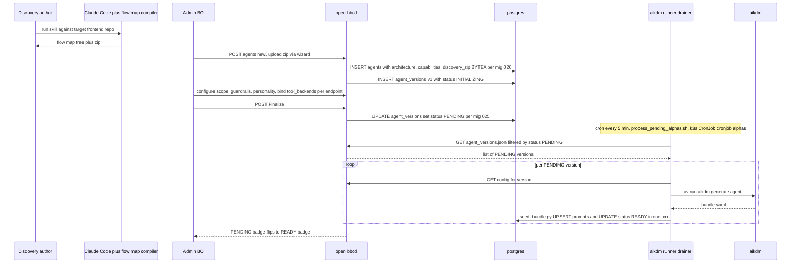
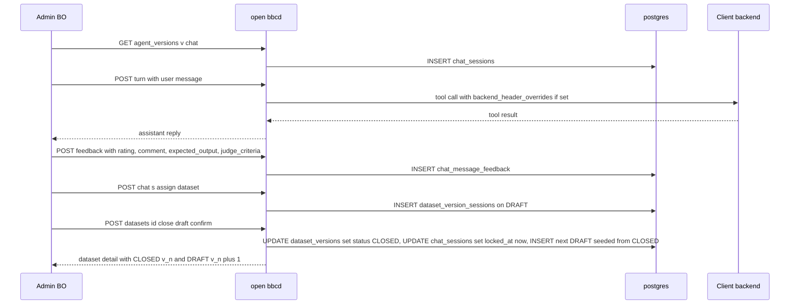
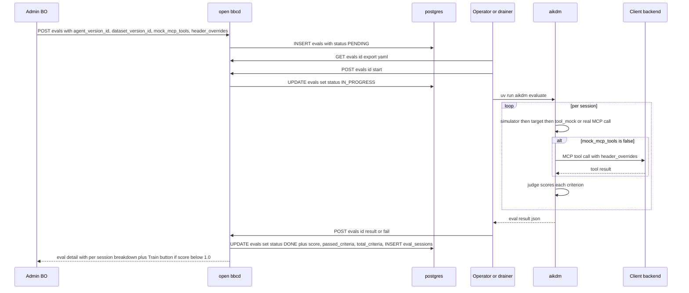
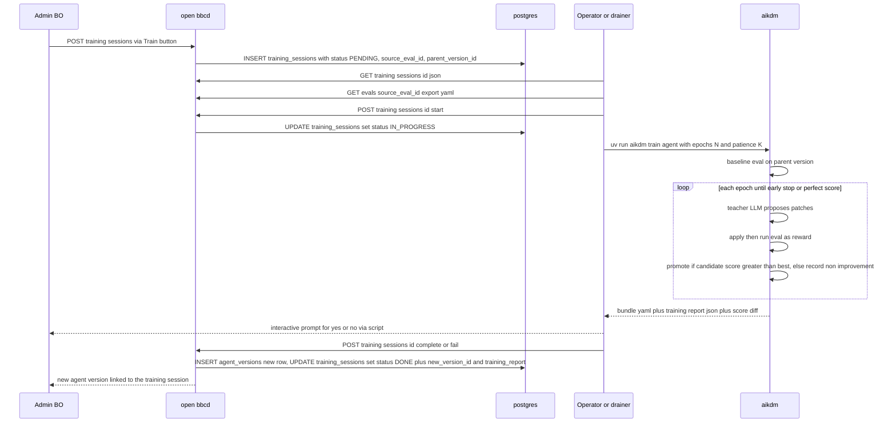
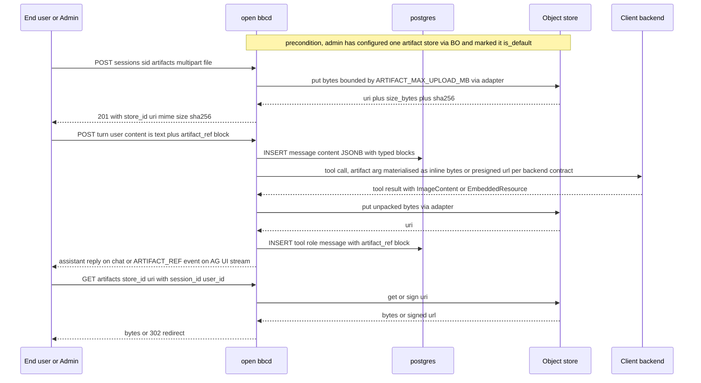
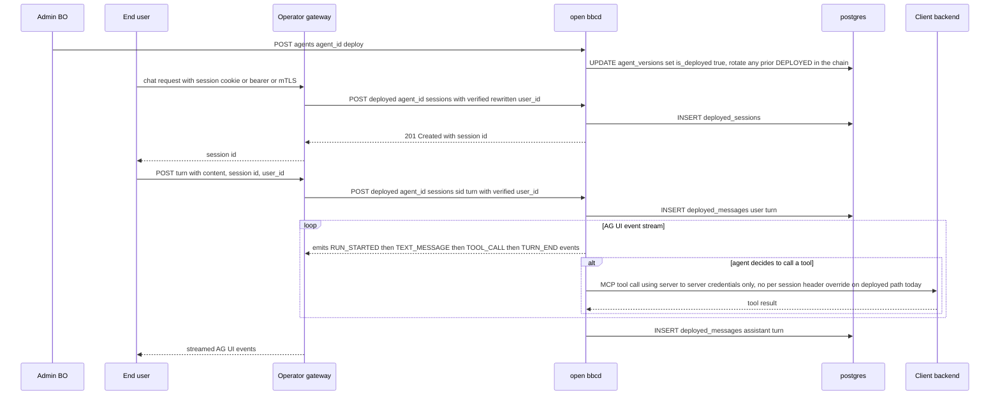

# Data flows

## Discovery → alpha agent

<!-- migrated from _migration-quarantine/DESIGN.md § Phase 0, § Phase I, ARCHITECTURE.md § Data Flow / Flow 1 on 2026-09-28. Updated 2026-09-28 for OpenBBC PR #50 — Finalize is now an async transition to PENDING, drained by the aikdm-runner CronJob; mig 026 keeps the zip inline. Rewritten 2026-09-28 to be safe against GitHub's strict mermaid parser (no slashes, hyphens, em dashes, parens, semicolons, or asterisks in message bodies). -->

## Feedback → dataset

<!-- migrated from _migration-quarantine/DESIGN.md § Phase II, ARCHITECTURE.md § Feedback + datasets, § Data Flow / Flow 2, § Chat header overrides on 2026-09-28. Rewritten 2026-09-28 for GitHub-safe mermaid syntax. -->

## Evaluation

<!-- migrated from _migration-quarantine/DESIGN.md § Phase III, ARCHITECTURE.md § Evals, § Data Flow / Flow 3, § Chat header overrides on 2026-09-28. Rewritten 2026-09-28 for GitHub-safe mermaid syntax. -->

## Automated training

<!-- migrated from _migration-quarantine/DESIGN.md § Phase IV, ARCHITECTURE.md § Training sessions, § Data Flow / Flow 4 on 2026-09-28. Rewritten 2026-09-28 for GitHub-safe mermaid syntax. -->

## Multimodal chat with artifacts

<!-- new data flow added 2026-09-28 for artifact-support. GitHub-safe mermaid syntax per diagram conventions. -->

## Deployment

<!-- migrated from _migration-quarantine/DESIGN.md § Phase V, ARCHITECTURE.md § Data Flow / Flow 5, PRODUCTION.md § 2 Integrating your frontend, § 4 Headers, § 5 Auth model on 2026-09-28. Rewritten 2026-09-28 for GitHub-safe mermaid syntax. -->
