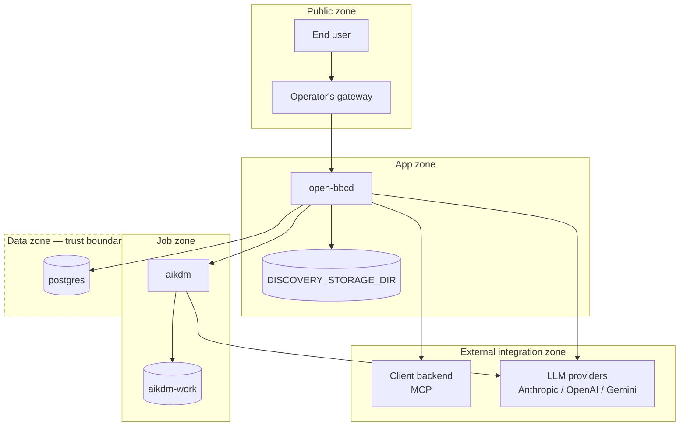

# Deployment

## Environments

- **Local Go** — `make build && ./bin/open-bbcd` with `$DATABASE_URL` pointing at Postgres.
  Migrations auto-apply on boot (goose embedded via `//go:embed`).
- **Docker Compose (single-instance)** — top-level `docker-compose.yml` brings up
  `postgres` + `open-bbcd`; `aikdm` sits behind the `aikdm` profile
  (`docker compose --profile aikdm run --rm aikdm …`). Suited for local dev + single-node
  production.
- **Standalone containers / k8s (bring-your-own Postgres)** — multi-arch images
  (`linux/amd64`, `linux/arm64`). Point `DATABASE_URL` at managed Postgres, ship the
  discovery-storage directory on a persistent volume. Registry publish, Helm chart, and
  multi-replica-safe migrations are **not yet shipped**.

<!-- migrated from _migration-quarantine/PRODUCTION.md § 1 Deploying, § 8 Known gaps, ARCHITECTURE.md § Docker deployment on 2026-09-28 -->

## Network zones

- **Public zone** — the operator's gateway (Envoy / nginx / API gateway) terminating
  customer auth. Only surface exposed to the internet.
- **App zone** — `open-bbcd` (`:8080`); reachable from the gateway and from the internal
  automation surface (operator, cron scripts). Backoffice UI lives in this zone.
- **Data zone (trust boundary)** — `postgres` (`:5432`) with `postgres-data` persistent
  volume; only `open-bbcd` reaches it. Discovery-storage volume (`DISCOVERY_STORAGE_DIR`,
  default `/data/discovery`) mounted at the app zone.
- **Job zone** — `aikdm` (batch / interactive container); mounts `./aikdm-work:/work`;
  reaches `open-bbcd`'s REST + the LLM providers. Never reaches `postgres`.
- **External integration zone** — LLM providers (Anthropic / OpenAI / Gemini) and the
  client's MCP-wrapped backend. Reached from the app zone + job zone by outbound HTTPS /
  SSE / Streamable HTTP.

Every container in [`containers.md`](containers.md) is placed:

| Container | Zone(s) |
|-----------|---------|
| [`flow-map-compiler`](containers.md#flow-map-compiler) | Discovery author's machine (outside all zones); its output ends up in App zone via wizard upload |
| [`open-bbcd`](containers.md#open-bbcd) | App zone |
| [`aikdm`](containers.md#aikdm) | Job zone |
| [`postgres`](containers.md#postgres) | Data zone |

<!-- migrated from _migration-quarantine/ARCHITECTURE.md § Docker deployment, PRODUCTION.md § 1, § 6 Batch operations, § 7 Provider LLM keys on 2026-09-28 -->

## Trust boundaries

- **Public ↔ App (via gateway)** — the gateway is the only allowed ingress from the public
  zone. `open-bbcd` trusts the `user_id` the gateway forwards; direct exposure of `open-bbcd`
  to the public zone bypasses the entire auth model.
- **App ↔ Data** — Postgres reachable only from `open-bbcd` on a private network. Marked as
  a dashed trust boundary in the diagram.
- **App ↔ External integration** — outbound MCP calls to the client backend and outbound
  HTTPS to LLM providers cross the boundary. MCP calls carry server-to-server credentials
  bound to the `tool_backends` row (plus per-backend `header_overrides` in the BO chat and
  eval paths — not on the deployed path).
- **Job ↔ App** — `aikdm` reaches `open-bbcd` via REST only; it never sees Postgres.

## Diagram

<!-- migrated from _migration-quarantine/ARCHITECTURE.md § Docker deployment, PRODUCTION.md § 1 Deploying, § 5 Auth model, § 7 Provider LLM keys on 2026-09-28 -->

## Threat model

| Boundary | Threat | Mitigation |
|----------|--------|-----------|
| Public ↔ App | **Spoofing** — attacker forges `user_id` in a request body/query to impersonate a real user. | Operator's gateway must verify auth and **rewrite** `user_id` to the verified identity before forwarding; never accept the client's `user_id` verbatim. |
| Public ↔ App | **Information disclosure** — attacker enumerates session ids across users. | `GET /deployed/{agent_id}/sessions/{id}?user_id=X` returns `404` (not `403`) on mismatch, blocking existence leaks. |
| Public ↔ App | **Elevation of privilege** — attacker reaches the backoffice UI directly, bypassing the gateway. | Restrict network reachability of the backoffice surface (private VPC / VPN / employee SSO) — the surface is too large for per-route allowlisting. |
| App ↔ External integration | **Tampering / repudiation** — MCP call to the client backend attributed to the wrong tenant. | Backoffice chat + eval paths carry `header_overrides` merged into MCP calls, allowing auth tokens / tenant scoping / correlation ids to flow through. Deployed-runtime path today uses server-to-server credentials only — mitigate via one MCP backend per tenant or per-user auth inside the MCP backend against a shared secret + gateway-injected header. |
| App ↔ Data | **Denial of service** — misbehaved migration on multi-replica boot races Postgres. | Currently mitigated by single-instance shipping. Multi-replica requires a pre-deploy `open-bbcd migrate` job to exit 0 before `serve` replicas start. Follow-up work: goose `Provider` + `SessionLocker`. |
| Public ↔ App | **Denial of service** — no rate limits on the deployed runtime. | ARCH_GAP — no rate-limit / abuse-control policy sourced. Rely on gateway for now. |
| App ↔ External integration | **Provider credential leak** — LLM provider API key exposure. | Keys must come from platform secret store in production, not `.env`. `open-bbcd` and `aikdm` read `ANTHROPIC_API_KEY`, `OPENAI_API_KEY`, `GEMINI_API_KEY` from env only. |

<!-- migrated from _migration-quarantine/PRODUCTION.md § 4 Headers, § 5 Auth model, § 7 Provider LLM keys, § 8 Known gaps on 2026-09-28 -->
