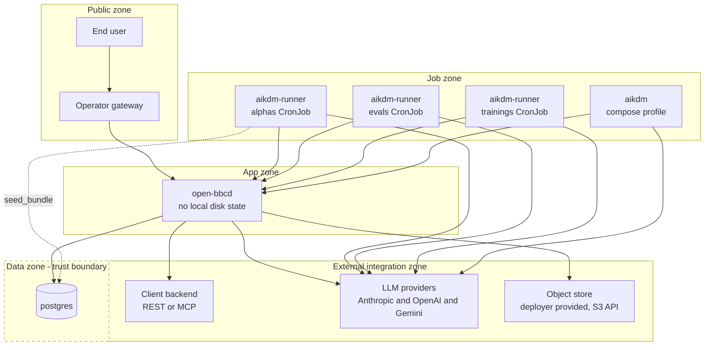

# Deployment

## Environments

**Shipping path — Kubernetes via Helm chart `deploy/helm/openbbc/`.** Ships one
`Deployment` replica of `open-bbcd` + `Service` + optional `Ingress`, an optional in-cluster
Postgres `StatefulSet` (or point `externalDatabase.url` at a managed DB), and three
`CronJob`s running the `aikdm-runner` image: alphas (`*/5 * * * *`, mounts `DATABASE_URL`),
evals (`*/10 * * * *`), trainings (`*/15 * * * *`). Chart default image repositories point
at `ghcr.io/dacdigital/openbbc/{open-bbcd,aikdm-runner}` — pick a `TAG`
(`pr-<num>`, `main`, `sha-<short>`, semver, `latest`) and `--set image.tag=$TAG`. The chart
exposes an optional `artifacts:` values block — store groups, credentials from an existing
Secret, and the upload / pending / signed-URL caps — rendered as the `ARTIFACT_*` env vars;
disabled by default.

**Local dev only — not shipping:**
- **Local Go** — `make build && ./bin/open-bbcd` with `$DATABASE_URL` pointing at Postgres.
  Migrations auto-apply on boot (goose embedded via `//go:embed`). Used by contributors
  running the Go tests + iterating on handler code.
- **Docker Compose** — top-level `docker-compose.yml` brings up `postgres` + `open-bbcd`;
  the plain `aikdm` image sits behind the `aikdm` compose profile
  (`docker compose --profile aikdm run --rm aikdm …`). After migration 026 the compose file
  no longer needs the `discovery-data` named volume. Used by contributors demoing the full
  stack + running the e2e Playwright suite. **Not a production deployment path** — no
  Ingress, no drainer CronJobs, no replica story.

<!-- migrated from _migration-quarantine/PRODUCTION.md § 1 Deploying, § 8 Known gaps, ARCHITECTURE.md § Docker deployment on 2026-09-28. Updated 2026-09-28 for OpenBBC PR #50 (Helm chart shipped; discovery-data volume removed per mig 026). Corrected 2026-09-28 to reflect that Docker Compose and Local Go are dev-only, not shipping deployment paths. Updated 2026-10-01 for sync-deployed-runtime-artifacts — Helm `artifacts:` values block. -->

## Network zones

- **Public zone** — the operator's gateway (Envoy / nginx / API gateway) terminating
  customer auth. Only surface exposed to the internet.
- **App zone** — `open-bbcd` (`:8080`); reachable from the gateway and from the internal
  automation surface (operator, cron scripts, k8s CronJobs). Backoffice UI lives in this
  zone. No local disk state after migration 026 — the pod holds no state on its filesystem;
  all persisted state lives in the Data zone.
- **Data zone (trust boundary)** — `postgres` (`:5432`) with `postgres-data` persistent
  volume; only `open-bbcd` and (on the alpha-drainer path) `aikdm-runner`'s `seed_bundle.py`
  reach it.
- **Job zone** — `aikdm` (compose profile, one-shot) and `aikdm-runner` (k8s CronJob pods).
  Mounts LLM keys as Secrets; reaches `open-bbcd`'s REST + the LLM providers. The
  alpha-drainer CronJob additionally mounts `DATABASE_URL`, so that pod crosses into the
  Data zone.
- **External integration zone** — LLM providers (Anthropic / OpenAI / Gemini, plus any
  provider `open-bbcd` reaches through the embedded Bifrost Go SDK; no Bifrost workload is
  deployed), the client's
  backend (either as an `http_endpoint` REST bridge or as an `mcp_client` MCP proxy), and
  the deployer-provided **Object store** (artifact-store backend, S3 API — reached only
  from the app zone through the `artifact-store-adapter`). Reached by outbound HTTPS / SSE
  / Streamable HTTP.

Every container in [`containers.md`](containers.md) is placed:

| Container | Zone(s) |
|-----------|---------|
| [`flow-map-compiler`](containers.md#flow-map-compiler) | Discovery author's machine (outside all zones); output enters App zone via wizard upload |
| [`open-bbcd`](containers.md#open-bbcd) | App zone |
| [`aikdm`](containers.md#aikdm) | Job zone (compose profile only) |
| [`aikdm-runner`](containers.md#aikdm-runner) | Job zone (all three drainers); alpha drainer additionally crosses into Data zone |
| [`postgres`](containers.md#postgres) | Data zone |

<!-- migrated from _migration-quarantine/ARCHITECTURE.md § Docker deployment, PRODUCTION.md § 1, § 6 Batch operations, § 7 Provider LLM keys on 2026-09-28. Updated 2026-09-28 for OpenBBC PR #50 (added aikdm-runner CronJobs; app zone stateless per mig 026; alpha drainer crosses Data zone). Updated 2026-10-07 for bifrost — Bifrost is in-process, no new zone placement. -->

## Trust boundaries

- **Public ↔ App (via gateway)** — the gateway is the only allowed ingress from the public
  zone. `open-bbcd` trusts the `user_id` the gateway forwards; direct exposure of `open-bbcd`
  to the public zone bypasses the entire auth model.
- **App ↔ Data** — Postgres reachable only from `open-bbcd` on a private network, plus the
  alpha-drainer pod (`aikdm-runner` running `process_pending_alphas.sh` →
  `generate_alpha.sh` → `seed_bundle.py`) which is granted `DATABASE_URL` explicitly.
  Marked as a dashed trust boundary in the diagram.
- **App ↔ External integration** — outbound tool calls to the client backend (as
  `http_endpoint` REST bridge OR `mcp_client` MCP proxy), outbound HTTPS to LLM providers,
  and outbound S3-API calls to the deployer-provided **Object store** for artifact
  put/get/delete via the `artifact-store-adapter` all cross the boundary. Tool calls carry
  server-to-server credentials bound to the `tool_backends` row (plus per-backend
  `header_overrides` in the BO chat and eval paths — not on the deployed path). Object-store
  credentials come from **env vars** (`ARTIFACT_STORE_<ID>_*`) — same secret-handling
  class as LLM provider API keys, not persisted in Postgres.
- **Job ↔ App** — `aikdm-runner` reaches `open-bbcd` via REST for all three drainers.
  Compose-profile `aikdm` uses the same path.

## Diagram

<!-- migrated from _migration-quarantine/ARCHITECTURE.md § Docker deployment, PRODUCTION.md § 1 Deploying, § 5 Auth model, § 7 Provider LLM keys on 2026-09-28. Updated 2026-09-28 for OpenBBC PR #50 — three CronJobs, stateless open-bbcd, alpha drainer's dashed line into Data zone. -->

## Threat model

| Boundary | Threat | Mitigation |
|----------|--------|-----------|
| Public ↔ App | **Spoofing** — attacker forges `user_id` in a request body/query to impersonate a real user. | Operator's gateway must verify auth and **rewrite** `user_id` to the verified identity before forwarding; never accept the client's `user_id` verbatim. |
| Public ↔ App | **Information disclosure** — attacker enumerates session ids across users. | `GET /deployed/{agent_id}/sessions/{id}?user_id=X` returns `404` (not `403`) on mismatch, blocking existence leaks. |
| Public ↔ App | **Elevation of privilege** — attacker reaches the backoffice UI directly, bypassing the gateway. | Restrict network reachability of the backoffice surface (private VPC / VPN / employee SSO) — the surface is too large for per-route allowlisting. |
| App ↔ External integration | **Tampering / repudiation** — MCP call to the client backend attributed to the wrong tenant. | Backoffice chat + eval paths carry `header_overrides` merged into MCP calls, allowing auth tokens / tenant scoping / correlation ids to flow through. Deployed-runtime path today uses server-to-server credentials only — mitigate via one MCP backend per tenant or per-user auth inside the MCP backend against a shared secret + gateway-injected header. |
| App ↔ Data | **Denial of service** — misbehaved migration on multi-replica boot races Postgres. | Currently mitigated by the Helm chart shipping one `open-bbcd` `Deployment` replica by default. Scaling `openbbcd.replicaCount > 1` needs the follow-up work tracked in `assumptions.md`: goose `Provider` + `SessionLocker`, or a pre-install migrations `Job` in the chart. |
| Public ↔ App | **Denial of service** — no rate limits on the deployed runtime. | ARCH_GAP — no rate-limit / abuse-control policy sourced. Rely on gateway for now. |
| App ↔ External integration | **Provider credential leak** — LLM provider API key exposure. With `OPENBBC_LLM_ADAPTER=bifrost`, `open-bbcd` may hold keys for several providers instead of one. | Keys must come from platform secret store in production, not `.env`. `open-bbcd` and `aikdm` read `ANTHROPIC_API_KEY`, `OPENAI_API_KEY`, `GEMINI_API_KEY` (and, on the Bifrost adapter, other `<PROVIDER>_API_KEY` vars) from env only. The Bifrost `Account` is built in memory from env at boot; no keys are persisted and no Bifrost config file is mounted. Deployers should mount only the key for the provider they select. |
| App ↔ External integration | **Artifact-store credential leak / tenant crossover.** Object-store credentials (`ARTIFACT_STORE_<ID>_ACCESS_KEY`, `_SECRET_KEY`) are shared server-to-server; a leak grants blob-store access; a mis-scoped bucket lets one deployment see another's artifacts. | Credentials come from env / operator secret store (same class as LLM provider API keys), never from `.env` files in production and never persisted in Postgres. Deployers scope buckets per deployment or per tenant; the framework does not enforce cross-`store_id` isolation beyond adapter-level bucket boundaries. |
| App ↔ External integration | **Artifact ref leak → cross-user read.** A leaked `{store_id, uri}` pair could bypass session-scope if the read route accepted refs without session context. | Retrieval is nested under the owning session (`GET /agent_versions/{v}/chat/{s}/artifacts/{store_id}/{uri...}`, `GET /deployed/{agent_id}/sessions/{sid}/artifacts/{store_id}/{uri...}?user_id=X`) and authorised only by a row in that session's artifact table, returning 404 on mismatch — the ref alone is not a bearer capability. User artifacts are staged server-side and claimed by the next turn; refs in a turn body are ignored, which blocks cross-session ref borrowing. Server-side MIME resolution, `X-Content-Type-Options: nosniff` and `Content-Disposition` (`inline` only for native-render types) keep a stored blob from being served as active content. Presigned URLs (when the adapter returns them) inherit the store's TTL and are logged for audit by the deployer's log aggregator. |
| Public ↔ App | **Denial of service via oversized artifact upload.** Attacker POSTs a very large body to the artifact upload endpoint. | `ARTIFACT_MAX_UPLOAD_MB` env var gates ingest at the upload boundary; `ARTIFACT_MAX_PENDING` (default 10) caps not-yet-consumed artifacts per session (`409` past it); the gateway may impose an additional body-size limit. |
| App ↔ External integration | **Denial of service / cost amplification via sub-agent fan-out.** A crafted user turn (or a prompt-injected tool result) drives the root LLM to spawn sub-agents repeatedly, multiplying LLM calls and backend load per turn. | Topology is acyclic by construction (only `INITIALIZING`/`DRAFT` versions bind `READY`/`DEPLOYED` targets; a bind-time cycle check remains as defence in depth); `AGENT_TOOL_MAX_DEPTH` (default 3) and `AGENT_TOOL_MAX_PARALLEL` (default 4) bound fan-out per turn; gateway rate limits still apply per root turn. No per-turn token budget yet — tracked in `assumptions.md`. |
| App ↔ External integration | **Elevation of privilege (confused deputy) via sub-agent wiring.** A sub-agent calls backends with its own version's wiring, so a caller can indirectly reach backends it is not wired to. | Bindings are admin-only BO configuration behind the backoffice network restriction; end users cannot choose targets outside the root version's allow-list. Deployed sub-agent calls use static `tool_backends.config` credentials, same as root calls; BO / eval `header_overrides` propagate only for matching backend ids. |
| Public ↔ App | **Information disclosure via child sessions.** Worker transcripts may hold intermediate data the root answer omits. | Deployed children carry the root's `user_id` and `agent_id`, so a tree never crosses into another agent's partition. Children are excluded from the session list, every per-session route returns `404` for a child id, and child transcripts are readable only through the root-scoped child route. On the AG-UI stream, only the root's text plus the worker's tagged tool-call **and tool-result** events reach the client: no sub-agent text tokens and no child `ARTIFACT_REF`. |

<!-- migrated from _migration-quarantine/PRODUCTION.md § 4 Headers, § 5 Auth model, § 7 Provider LLM keys, § 8 Known gaps on 2026-09-28. Updated 2026-09-28 for artifact-support — added threats for artifact-store creds, ref-based cross-user read, oversized upload. Updated 2026-09-30 for multiagent-tools — added sub-agent fan-out, confused-deputy, child-session disclosure threats. Updated 2026-10-01 for sync-deployed-runtime-artifacts — artifact ref-leak mitigation (row allow-list, staged uploads, MIME resolution, nosniff, Content-Disposition), ARTIFACT_MAX_PENDING. Updated 2026-10-05 for sync-multiagent-feature — topology acyclic by construction, child-session disclosure mitigation. Updated 2026-10-07 for bifrost — multi-provider key exposure on the Bifrost adapter. -->
