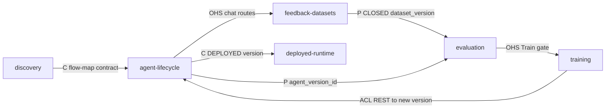

# Context map

## Contexts

- [`agent-lifecycle`](contexts/agent-lifecycle.md) — agents, versions, capabilities, wiring,
  MCP attachments, deployment.
- [`feedback-datasets`](contexts/feedback-datasets.md) — backoffice chat sessions,
  per-message feedback, DRAFT/CLOSED dataset lifecycle.
- [`evaluation`](contexts/evaluation.md) — one eval per (agent version, dataset version) with
  per-session judgments and global pass-rate scoring.
- [`training`](contexts/training.md) — one training session per (source eval, parent
  version); hill-climb produces a new agent version.
- [`deployed-runtime`](contexts/deployed-runtime.md) — production runtime sessions between
  end user and DEPLOYED agent version, over AG-UI.
- [`discovery`](contexts/discovery.md) — `.flow-map/` compilation from a client frontend
  repo; runs at the discovery author's machine, out of the platform's DB.

## Relationships

| Upstream | Downstream | Pattern | Interface |
|----------|------------|---------|-----------|
| `discovery` | `agent-lifecycle` | U/D — Conformist (C) | `.flow-map/` zip: `flows/`, `capabilities/`, `agents/`; `agent-lifecycle` conforms to the shape declared in the discovery skill's contract triple (`output-schemas.md` / `lint-contract.md` / templates). |
| `agent-lifecycle` | `feedback-datasets` | U/D — Open Host Service (OHS) | `agent-lifecycle` publishes an `agent_version_id` and BO chat routes (`/agent_versions/{id}/chat`); `feedback-datasets` consumes it to author sessions + feedback. |
| `feedback-datasets` | `evaluation` | U/D — Partnership (P) | CLOSED `dataset_version` is the eval's dataset; the two contexts share the invariant "close-draft refuses if any member session has empty `judge_criteria`" — locked by DB constraint + repo enforcement. |
| `agent-lifecycle` | `evaluation` | U/D — Partnership (P) | Eval targets an `agent_version_id`; scoring reuses the version's `agents.architecture` + `agent_versions.prompts` at replay time. |
| `evaluation` | `training` | U/D — Open Host Service (OHS) | Eval detail exposes the Train button gate (DONE + `score < 1.0` + no active session); training reads `source_eval_id`, `parent_version_id`. |
| `training` | `agent-lifecycle` | U/D — Anti-Corruption Layer (ACL) | Training complete inserts a new `agents` version (`new_version_id`); the ACL is the aikdm→open-bbcd REST boundary that enforces the `agent_versions.prompts`-only mutation and never touches `agents.architecture`. |
| `agent-lifecycle` | `deployed-runtime` | U/D — Conformist (C) | Marking a version DEPLOYED (`POST /agents/{agent_id}/deploy`) exposes it under `/deployed/{agent_id}/*`; deployed-runtime conforms to the version's frozen wiring. |
| `deployed-runtime` | External client backend | U/D — Anti-Corruption Layer (ACL) | Tool calls go out via MCP over SSE/Streamable HTTP; `open-bbcd`'s `toolBackendStoreAdapter` is the ACL between runtime tool builder and the `tool_backends` config. |

<!-- migrated from _migration-quarantine/ARCHITECTURE.md § Components, § MCP wiring, § Feedback + datasets, § Evals, § Training sessions, DESIGN.md § Flow, PRODUCTION.md § 3 MCP layer on 2026-09-28 -->

## Diagram

