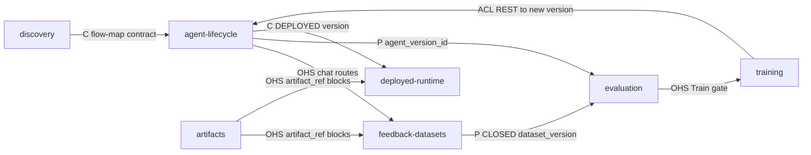

# Context map

## Contexts

- [`agent-lifecycle`](contexts/agent-lifecycle.md) — agents, versions, capabilities, wiring,
  MCP attachments, deployment.
- [`feedback-datasets`](contexts/feedback-datasets.md) — backoffice chat sessions,
  per-message feedback, DRAFT/CLOSED dataset lifecycle.
- [`evaluation`](contexts/evaluation.md) — one eval per (agent version, dataset version) with
  per-session judgments and global pass-rate scoring.
- [`training`](contexts/training.md) — one training session per (source eval, parent
  version); hill-climb produces a new agent version.
- [`deployed-runtime`](contexts/deployed-runtime.md) — production runtime sessions between
  end user and DEPLOYED agent version, over AG-UI.
- [`discovery`](contexts/discovery.md) — `.flow-map/` compilation from a client frontend
  repo; runs at the discovery author's machine, out of the platform's DB.
- [`artifacts`](contexts/artifacts.md) — env-hydrated artifact-store registry,
  put/get/sign/stat/delete against the configured backend, MCP tool-result normalisation and
  MIME resolution; supplies `artifact_ref` content blocks to `feedback-datasets` and
  `deployed-runtime`. Owns no tables.

## Relationships

| Upstream | Downstream | Pattern | Interface |
|----------|------------|---------|-----------|
| `discovery` | `agent-lifecycle` | U/D — Conformist (C) | `.flow-map/` zip: `flows/`, `capabilities/`, `agents/`; `agent-lifecycle` conforms to the shape declared in the discovery skill's contract triple (`output-schemas.md` / `lint-contract.md` / templates). |
| `agent-lifecycle` | `feedback-datasets` | U/D — Open Host Service (OHS) | `agent-lifecycle` publishes an `agent_version_id` and BO chat routes (`/agent_versions/{id}/chat`); `feedback-datasets` consumes it to author sessions + feedback. Sub-agent bindings on that version determine which child chat sessions a turn may spawn. |
| `feedback-datasets` | `evaluation` | U/D — Partnership (P) | CLOSED `dataset_version` is the eval's dataset; the two contexts share the invariant "close-draft refuses if any member session has empty `judge_criteria`" — locked by DB constraint + repo enforcement. |
| `agent-lifecycle` | `evaluation` | U/D — Partnership (P) | Eval targets an `agent_version_id`; scoring reuses the version's `agents.architecture` + `agent_versions.prompts` at replay time — plus, for multi-agent versions, the same for every pinned sub-agent version reachable through `agent_version_subagent` (transitive export). |
| `evaluation` | `training` | U/D — Open Host Service (OHS) | Eval detail exposes the Train button gate (DONE + `score < 1.0` + no active session); training reads `source_eval_id`, `parent_version_id`. |
| `training` | `agent-lifecycle` | U/D — Anti-Corruption Layer (ACL) | Training complete inserts a new `agents` version (`new_version_id`); the ACL is the aikdm→open-bbcd REST boundary that enforces the `agent_versions.prompts`-only mutation and never touches `agents.architecture`. |
| `agent-lifecycle` | `deployed-runtime` | U/D — Conformist (C) | Marking a version DEPLOYED (`POST /agents/{agent_id}/deploy`) exposes it under `/deployed/{agent_id}/*`; deployed-runtime conforms to the version's frozen wiring, including its sub-agent bindings — pinned targets run as child sessions whether or not they are themselves DEPLOYED. |
| `deployed-runtime` | External client backend | U/D — Anti-Corruption Layer (ACL) | Tool calls go out via MCP over SSE/Streamable HTTP; `open-bbcd`'s `toolBackendStoreAdapter` is the ACL between runtime tool builder and the `tool_backends` config. |
| `artifacts` | `feedback-datasets` | U/D — Open Host Service (OHS) | `artifacts` publishes the `artifact_ref` content-block shape and the registry / adapter / normalisation / MIME-resolution services; `feedback-datasets` embeds refs on `chat_messages.content` and treats them as opaque, owns `chat_session_artifacts` (session-artifact identity, pending → consumed lifecycle, read allow-list), and publishes the BO session-scoped upload / read / pending-artifact routes that call into `artifacts`. |
| `artifacts` | `deployed-runtime` | U/D — Open Host Service (OHS) | Same OHS contract as above, embedded on `deployed_messages.content`; `deployed-runtime` owns `deployed_session_artifacts`, publishes the deployed session-scoped upload / read / pending-artifact routes, and streams tool-result refs as the AG-UI `CUSTOM` `ARTIFACT_REF` event. |
| `artifacts` | External object store | U/D — Anti-Corruption Layer (ACL) | The artifact-store adapter (`s3_compatible` first kind) is the ACL between the framework's uniform `put/get/delete/stat` contract and each concrete store API; adapter config comes from `ARTIFACT_STORE_<ID>_*` env vars hydrated into an in-memory registry at boot (refs carry the env-registry `store_id` slug; there is no `artifact_stores` table). |
| `feedback-datasets` | `evaluation` (via artifact refs) | U/D — Conformist (C) | Closed sessions' `artifact_ref` blocks are exported unchanged in `export.yaml`; eval replay is text-only (the files are not replayed) until an artifact-aware replay follow-up. Refs on locked sessions stay resolvable for retrieval — the invariant "refs stay resolvable while any locked session references them" is upheld by `artifacts`. |

<!-- migrated from _migration-quarantine/ARCHITECTURE.md § Components, § MCP wiring, § Feedback + datasets, § Evals, § Training sessions, DESIGN.md § Flow, PRODUCTION.md § 3 MCP layer on 2026-09-28. Updated 2026-09-28 for artifact-support — added artifacts context relationships. Updated 2026-09-30 for multiagent-tools — sub-agent bindings in agent-lifecycle → feedback-datasets / evaluation / deployed-runtime interfaces. Updated 2026-10-01 for sync-deployed-runtime-artifacts — session-artifact tables + routes owned by feedback-datasets / deployed-runtime, env-hydrated registry (no artifact_stores table), CUSTOM ARTIFACT_REF, text-only eval replay. -->

## Diagram

